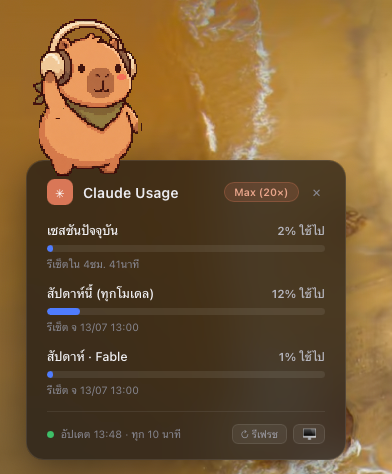

# Claude Usage — Desktop Widget (macOS / Übersicht)

การ์ดแสดง **plan usage limits ของ Claude** (session / weekly / per-model) เป็น widget บน
desktop ของ Mac อัปเดตอัตโนมัติทุก ~10 นาที มีปุ่ม refresh ทันที, ล็อกเลือกจอ, ล็อกอิน/รีเฟรช
token ในตัว — และมี **น้อง CapyBeats 🎧** คาปิบาร่า pixel-art นั่งโยกอยู่บนหัวการ์ด

> ทำงานได้เพราะดึงผ่าน **OAuth endpoint ของ Claude Code** (`/api/oauth/usage`) โดยตรง —
> ไม่ผ่าน `claude.ai` ที่ติด Cloudflare จึงยิงจาก background script ได้ (ดู [ความรู้เบื้องหลัง](#-ความรู้เบื้องหลัง-สำคัญ))

<p align="center">
  
</p>

---

## ✨ ฟีเจอร์

- 🟦 **Progress bar** ต่อ limit: session / weekly (ทุกโมเดล) / weekly per-model
  (สีน้ำเงิน → เหลืองเมื่อ ≥80% → แดงเมื่อ ≥95%)
- ⏱️ เวลา reset: session แสดง "รีเซ็ตใน Xh Ym", weekly แสดงวัน+เวลา (เวลาเครื่อง)
- 🏷️ **ป้าย plan อัตโนมัติ** (Max 20× / Max 5× / Pro …) อ่านจาก credential ของแต่ละคน
- 🎧 **CapyBeats** — คาปิบาร่า pixel-art 72 เฟรม โยกอยู่บนหัวการ์ด (CSS `steps()` ล้วน ไม่กิน CPU,
  ปรับขนาดได้ที่ `CAPY_SCALE`)
- 🛡️ **กัน rate limit (429) ในตัว script** — TTL cache 5 นาที (เรียกกี่ครั้งก็ยิง API จริงไม่เกิน
  1 ครั้ง/TTL) และเจอ 429 จะพักยิง 15 นาทีเองอัตโนมัติ ระหว่างนั้นโชว์ค่าเดิม
- 🖱️ **ลากย้ายได้** — จับที่แถบหัวการ์ด จำตำแหน่งไว้ (localStorage)
- 🖥️ **รองรับหลายจอ** — ปุ่ม 🖥️ เปิด dropdown เลือกจอที่จะให้ widget อยู่
- 🔄 **ปุ่ม ↻ รีเฟรช** — ดึงข้อมูลใหม่ทันที (`--force` ข้าม TTL cache แต่ไม่ฝ่า backoff 429)
  และ**ไม่มีทางวาดทับข้อมูลดีด้วย error** — ถ้าผลลัพธ์เพี้ยนจะคงค่าเดิมไว้เสมอ
- 🔑 **ปุ่มล็อกอิน/รีเฟรช token** — เปิด Terminal รัน `claude` เมื่อ session หลุด
- 💾 **Cache/stale** — ถ้า token หมดอายุ/เน็ตล่ม จะโชว์ค่าเดิม + ไฟเตือน แทนที่จะว่างเปล่า
- ✕ **ย่อเป็น pill เล็ก** — คลิก ✕ ยุบเหลือวงกลม % session, คลิกซ้ำกางคืน

---

## 📦 ความต้องการของระบบ

- macOS (Apple Silicon หรือ Intel)
- [Claude Code CLI](https://claude.com/claude-code) ติดตั้งและ **ล็อกอินอยู่** (widget อ่าน OAuth token ที่มันเก็บ)
- [Übersicht](https://tracesof.net/uebersicht/) (installer ติดตั้งให้ผ่าน Homebrew ได้)
- `python3` (มากับ macOS)

---

## 🚀 ติดตั้ง (เครื่องใหม่ / เพื่อนร่วมทีม)

```bash
git clone <repo-url> claude-usage-widget
cd claude-usage-widget
bash install-claude-usage-widget.command      # หรือดับเบิลคลิกไฟล์นี้ใน Finder
```

installer จะ:
1. เช็ก/ติดตั้ง Übersicht (ผ่าน `brew install --cask ubersicht`)
2. copy `claude-usage.jsx` ไปโฟลเดอร์ widgets ของ Übersicht **พร้อมแก้ path สคริปต์ให้ตรงเครื่องอัตโนมัติ**
   และ copy `capybeats.png` (spritesheet คาปิบาร่า) ไปเป็น `claude-usage-capy.png`
3. ดึง usage ครั้งแรก (วอร์ม cache)
4. เปิด + รีเฟรช Übersicht

การ์ดจะขึ้นมุมขวาบนของ desktop ภายในไม่กี่วินาที

> ครั้งแรกกับหลายจอ: การ์ดจะขึ้นทุกจอ — กดปุ่ม **🖥️** ท้ายการ์ดแล้วเลือกจอที่ต้องการ
> จออื่นจะซ่อนเอง (เลือก "แสดงทุกจอ" เพื่อกลับมาโชว์ทุกจอ)

### ถอนการติดตั้ง
```bash
bash uninstall-claude-usage-widget.command
```

---

## 🧩 ไฟล์ในโปรเจกต์

| ไฟล์ | หน้าที่ |
|------|---------|
| `claude-usage.sh` | ดึง usage ผ่าน OAuth token — โหมด `--json` (ให้ widget ใช้) และโหมด pretty (ดีบั๊กใน terminal) พร้อม TTL cache + 429 backoff ในตัว |
| `claude-usage.jsx` | Übersicht widget (แบบ A การ์ดเต็ม) — เรนเดอร์จาก `limits[]`, ลาก/ล็อกจอ/refresh/login + CapyBeats |
| `capybeats.png` | spritesheet คาปิบาร่า 72 เฟรม (8×9, เฟรมละ 192×208) — เอาไปใช้ต่อในโปรเจกต์อื่นได้เลย |
| `install-claude-usage-widget.command` | ตัวติดตั้ง (idempotent — รันซ้ำเพื่ออัปเดต widget ได้) |
| `uninstall-claude-usage-widget.command` | ตัวถอน |
| `CLAUDE.md` | บันทึกการทำงาน/ความรู้แบบละเอียด (ภาษาไทย) |
| `snapshort/image.png` | ภาพตัวอย่าง widget บน desktop จริง |

รันสคริปต์ตรงๆ เพื่อทดสอบ:
```bash
bash claude-usage.sh                  # แสดงผลอ่านง่ายใน terminal
bash claude-usage.sh --json           # JSON ดิบ (แบบที่ widget ใช้ — ผ่าน TTL cache)
bash claude-usage.sh --json --force   # บังคับยิง API ใหม่ (ข้าม TTL, ไม่ฝ่า backoff 429)
```

---

## 🔍 ความรู้เบื้องหลัง (สำคัญ)

### ใช้ OAuth endpoint ของ Claude Code — ไม่ใช่ claude.ai
```
GET https://api.anthropic.com/api/oauth/usage
Authorization: Bearer <ACCESS_TOKEN>
```
- endpoint นี้คือตัวที่คำสั่ง `/usage` ใน Claude Code ใช้ → **ไม่ติด Cloudflare** ยิงจากสคริปต์ได้
- ตรงข้ามกับ `https://claude.ai/api/.../usage` (cookie `sessionKey`) ที่ยิงนอกเบราว์เซอร์แล้วโดน
  Cloudflare เด้ง (403 / "Just a moment...") — **ทางตัน** สำหรับ background script

### token เก็บที่ไหน (macOS)
Claude Code เก็บ OAuth credential ไว้ที่ **Keychain**:
- service: `Claude Code-credentials`  ·  account: `$USER`
- โครงสร้าง (ห่อด้วย `claudeAiOauth`):
  ```json
  { "claudeAiOauth": { "accessToken": "sk-ant-oat01-…", "refreshToken": "…",
    "expiresAt": 0, "subscriptionType": "max", "rateLimitTier": "default_claude_max_20x" } }
  ```
- อ่านด้วย: `security find-generic-password -a "$USER" -w -s "Claude Code-credentials"`
- `/usr/bin/security` อ่านได้โดย **ไม่มี GUI prompt** แม้ถูกเรียกจาก Übersicht (ทดสอบด้วย `launchctl asuser`)
- บาง setup เก็บเป็นไฟล์ `~/.claude/.credentials.json` แทน (สคริปต์รองรับทั้งสองแบบ)
- **แกะ token ด้วย `python3` (parse JSON)** ไม่ใช่ `sed` — blob เป็นบรรทัดเดียวยาว sed พลาดง่าย

### โครงสร้าง response (`/api/oauth/usage`)
```
five_hour.utilization / .resets_at     ← session (0-100 %)
seven_day.utilization / .resets_at     ← weekly ทุกโมเดล
limits[]  { kind: session|weekly_all|weekly_scoped, percent, severity,
            resets_at, scope.model.display_name }   ← มี label สวย + per-model
```
> oauth endpoint **ก็มี `limits[]`** (ไม่ใช่แค่ฝั่ง claude.ai) — widget เรนเดอร์จากตรงนี้เป็นหลัก

### token refresh / session หลุด
- accessToken หมดอายุทุก ~1 ชม. (`expiresAt`), refreshToken อายุ ~28 วัน
- **auto-refresh (built-in):** ถ้า accessToken เหลือ <15 นาที สคริปต์จะขอ token ใหม่เองด้วย refreshToken
  แล้วเขียนกลับ Keychain — เพราะ widget รันทุก 10 นาที จึง**เลี้ยง token ให้สดได้เองยาวๆ** โดยไม่ต้องเปิด claude
  ```
  POST https://platform.claude.com/v1/oauth/token
  { "grant_type":"refresh_token", "refresh_token":"…",
    "client_id":"9d1c250a-e61b-44d9-88ed-5944d1962f5e" }   # client_id ของ Claude Code
  ```
  เขียน Keychain **เฉพาะตอน refresh สำเร็จ** (ล้มเหลว → credential เดิมไม่ถูกแตะ, fallback เป็น stale)
- ถ้า refreshToken หมดอายุจริง (นานเป็นเดือนไม่ได้ใช้) → widget โชว์ 🔑 ให้เปิด `claude` ล็อกอินใหม่
- แยก HTTP status: `429` = rate limit (ชั่วคราว, ไม่ใช่ token หมด) · `401/403` = auth

### กัน 429 ที่ตัว script (self rate-limit)
endpoint นี้โดน 429 ได้ถ้ายิงถี่ (Übersicht reload widgets, ตื่นจาก sleep, กดรีเฟรชรัวๆ) —
script เลย cap ตัวเอง:
- **TTL cache** (`CU_TTL`, default 300s): cache สดกว่านี้ → ตอบจาก `~/.claude/usage-cache.json`
  ทันทีโดยไม่แตะ API → ต่อให้ถูกเรียกกี่ครั้งก็ยิงจริงไม่เกิน 1 ครั้ง/TTL
- **Backoff** (`CU_BACKOFF`, default 900s): เจอ 429 เมื่อไหร่ บันทึกเวลาไว้ที่ `~/.claude/usage-backoff`
  แล้วหยุดยิงจนพ้นช่วงพัก (แม้ใช้ `--force`) ระหว่างนั้นตอบค่าเดิมเป็น stale — ยิงสำเร็จครั้งถัดไปล้างเอง

---

## 🛠️ ปรับแต่ง

- **ตำแหน่ง/ขนาดเริ่มต้น**: แก้ `.cu-card { top / right / width }` ใน `claude-usage.jsx`
  (หรือแค่ลากการ์ดเอา แล้วมันจำตำแหน่งให้)
- **ความถี่รีเฟรช**: `refreshFrequency` (มิลลิวินาที) ใน `claude-usage.jsx`
- **ขนาดคาปิบาร่า**: `CAPY_SCALE` ใน `claude-usage.jsx` (0.5 = เล็ก, 0.75 = default, 1 = เท่าต้นฉบับ)
  ความเร็วโยกอยู่ที่ `animation: cuCapX 0.8s … cuCapY 7.2s` (คงอัตราส่วน 1:9 ไว้)
- **TTL / backoff**: env `CU_TTL`, `CU_BACKOFF` (วินาที) ตอนเรียก `claude-usage.sh`
- **สี threshold**: ฟังก์ชัน `barColor()` ใน `claude-usage.jsx`
- **ป้าย plan**: ตรวจอัตโนมัติจาก credential — เพิ่ม mapping ได้ที่ `PY_PLAN` ใน `claude-usage.sh`

---

## ❓ แก้ปัญหา

| อาการ | วิธีแก้ |
|-------|---------|
| การ์ดไม่ขึ้นเลย | คลิกไอคอน Übersicht บนเมนูบาร์ → **Refresh All Widgets** / เปิด **Show widgets on desktop** |
| ไม่มีไอคอน Übersicht บนเมนูบาร์ | เปิดแอป Übersicht จาก Launchpad (หรือ `brew install --cask ubersicht` ใหม่) แล้วรัน installer อีกครั้ง |
| การ์ดโชว์ไฟเหลือง/แดง "token หมดอายุ" | กดปุ่ม 🔑 บนการ์ด (หรือเปิด Terminal พิมพ์ `claude` เอง) แล้วกด ↻ รีเฟรช |
| ไฟเหลือง "พัก 429" | ปกติ — script โดน rate limit เลยพักยิง ~15 นาทีแล้วกลับมาเอง ระหว่างนั้นโชว์ค่าเดิม |
| โชว์ทุกจอ | กดปุ่ม **🖥️** ท้ายการ์ด แล้วเลือกจอที่ต้องการ |
| คาปิบาร่าไม่ขึ้น | เช็กว่ามี `claude-usage-capy.png` ในโฟลเดอร์ widgets (รัน installer อีกครั้งจะ copy ให้) |
| ป้าย plan ไม่ตรง | เพิ่ม mapping tier ที่ `PY_PLAN` ใน `claude-usage.sh` |

---

## English (short)

Desktop widget for macOS ([Übersicht](https://tracesof.net/uebersicht/)) showing **Claude plan
usage limits**. It reads Claude Code's OAuth token from the macOS Keychain
(`security … -s "Claude Code-credentials"`) and calls
`GET https://api.anthropic.com/api/oauth/usage` — the same endpoint `/usage` uses, which is **not
behind Cloudflare** (unlike `claude.ai`). Features: draggable, per-monitor lock, refresh-now,
a key button to re-login/refresh the token when the session drops, built-in self rate-limiting
(5-min TTL cache + 15-min backoff after HTTP 429), and **CapyBeats** — a pixel-art capybara
(72-frame spritesheet, pure CSS `steps()` animation) grooving on top of the card. The spritesheet
(`capybeats.png`) is included — feel free to reuse it.

Install: `bash install-claude-usage-widget.command` (handles Übersicht install + path rewrite).
See [ความรู้เบื้องหลัง](#-ความรู้เบื้องหลัง-สำคัญ) for the reverse-engineering notes.
