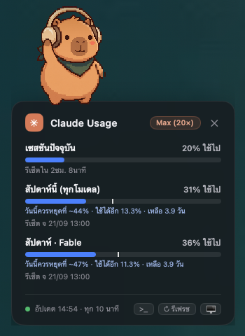

# Claude Usage — แอปดู Claude usage limits บน Mac

แอป macOS แสดง **plan usage limits ของ Claude** (session / weekly / per-model) เป็นตัวเลข % บน**เมนูบาร์**
และ**การ์ดลอยบน desktop** อัปเดตเองทุก 10 นาที บอกด้วยว่า**วันนี้ควรใช้ถึงประมาณเท่าไหร่** —
มีน้อง **CapyBeats 🎧** คาปิบาร่า pixel-art นั่งโยกอยู่บนหัวการ์ด

> ดึงข้อมูลผ่าน **OAuth endpoint ของ Claude Code** (`/api/oauth/usage`) ด้วย token ที่ Claude Code
> เก็บไว้ใน Keychain อยู่แล้ว — ไม่ต้องใส่รหัส/คุกกี้เอง และไม่ติด Cloudflare แบบ `claude.ai`
> (ดู [ความรู้เบื้องหลัง](#-ความรู้เบื้องหลัง))

<p align="center">
  
</p>

---

## ✨ ฟีเจอร์

- 📊 **ตัวเลขบนเมนูบาร์** — % ของ session ปัจจุบัน เปลี่ยนสีเหลือง ≥80% · แดง ≥95% · เหลืองเมื่อข้อมูลค้าง
- 🟦 **การ์ดบน desktop** — bar ต่อ limit: session / weekly ทุกโมเดล / weekly per-model (เช่น Fable)
  พร้อมเวลารีเซ็ต (session: "รีเซ็ตใน Xชม. Yนาที", weekly: วัน+เวลาตามเครื่อง)
- 🎯 **เป้าใช้งานรายวัน (daily pacing)** — weekly limit บอกว่า "วันนี้ควรหยุดที่ ~X%" + เส้นขีดบน bar
  - เอาโควตาที่**เหลือจริง**หารด้วยวันที่เหลือถึงรีเซ็ต (เศษทศนิยมตามชั่วโมง เช่น 3.9 วัน)
  - จำค่าตอนต้นวันไว้ → เป้า**คงที่ทั้งวัน**; วันไหนใช้เกิน/ขาด วันถัดไปปรับโควตาให้เอง
  - bar per-model (Fable) ถูก**แคปด้วยโควตาที่ weekly รวมเหลือ**อีกชั้น เพราะดึงจากก้อนเดียวกัน
    (ขึ้น "จำกัดโดยโควตาสัปดาห์รวม")
- `>_` **เปิด terminal ที่ `~/dev`** — iTerm2 (ไม่มีใช้ Terminal) · เปลี่ยนโฟลเดอร์ได้
- 🔑 **ล็อกอินใหม่ในคลิกเดียว** — เมื่อ token ต่ออายุเองไม่ได้ ปุ่มนี้เปิด iTerm2 แล้วรัน `claude` ให้
- 🔄 **ต่ออายุ token เอง** — script ใช้ refresh token ต่ออายุให้ก่อนหมด ไม่ต้องเปิด Claude Code ค้างไว้
- 🛡️ **ไม่ยิง API ถี่** — cache 5 นาที + เจอ HTTP 429 พักเอง 15 นาที ระหว่างนั้นโชว์ค่าเดิม
- 💾 **ข้อมูลค้างก็ยังเห็น** — เน็ตล่ม/token หลุด โชว์ค่าล่าสุด + แถบเตือนชัดเมื่อค้างนานเกิน ~1 ชม.
  (ผลเพี้ยนไม่มีวันวาดทับข้อมูลที่ดี)
- 🖱️ **ลากย้ายได้** จำตำแหน่งแยกต่อจอ · 🖥️ **เลือกจอ** (ถอดจอที่เลือกออก → ย้ายไปจอหลักเอง)
  · ✕ **ย่อเป็นวงกลม** · **เปิดเองตอนเปิดเครื่อง**
- 🪶 **เบา** — CPU ~0%, RAM ~60 MB, ไม่มี dependency ภายนอก

---

## 📦 ความต้องการ

- macOS 14 ขึ้นไป (Apple Silicon หรือ Intel)
- **Command Line Tools** — `xcode-select --install` (ใช้ build แอป + ได้ `python3` ที่ script ใช้) ไม่ต้องมี Xcode
- [Claude Code](https://claude.com/claude-code) ติดตั้งและ **ล็อกอินแล้ว** (รัน `claude` สักครั้ง)
- (แนะนำ) [iTerm2](https://iterm2.com) — ถ้าไม่มี ปุ่มต่างๆ จะใช้ Terminal แทน

---

## 🚀 ติดตั้ง

```bash
mkdir -p ~/dev && cd ~/dev
git clone https://github.com/PanithanNanti/claude-usage-widget.git
cd claude-usage-widget
bash app/scripts/install-app.sh
```

สคริปต์จะ build แล้ววางแอปที่ `~/Applications/ClaudeUsageBar.app` และเปิดให้ทันที —
ตัวเลข % ขึ้นบนเมนูบาร์ การ์ดขึ้นบน desktop

**หลังติดตั้ง (ครั้งเดียว):**
1. คลิกตัวเลขบนเมนูบาร์ → **เปิดแอปตอนล็อกอินเข้าเครื่อง**
2. ครั้งแรกที่กด 🔑 macOS จะถามว่าให้ "Claude Usage" ควบคุม iTerm/Terminal ไหม → **Allow**

> ต้อง build บนเครื่องที่จะใช้ — แอปเซ็นแบบ ad-hoc ถ้า copy `.app` ข้ามเครื่องจะโดน Gatekeeper บล็อก
> ใช้หลายเครื่องพร้อมกันได้ (โควตาเป็นของบัญชี ทุกเครื่องเห็นเลขเดียวกัน) ค่าที่ตั้งไว้เก็บแยกต่อเครื่อง

### อัปเดต
```bash
cd ~/dev/claude-usage-widget && git pull && bash app/scripts/install-app.sh
```

### ถอนการติดตั้ง
```bash
bash app/scripts/uninstall-app.sh
```
ถ้าเคยเปิด "เปิดแอปตอนล็อกอิน" ไว้ ให้ลบรายการที่ System Settings → General → Login Items ด้วย
(สคริปต์ไม่แตะ `~/.claude` หรือ credential ใดๆ)

---

## 🕹️ ใช้งาน

**ปุ่มท้ายการ์ด**

| ปุ่ม | ทำอะไร |
|------|--------|
| `>_` | เปิด iTerm2/Terminal ที่ `~/dev` |
| ↻ รีเฟรช | ดึงข้อมูลใหม่ทันที (ข้าม cache แต่ไม่ฝ่าช่วงพัก 429) |
| 🖥️ | เลือกจอที่จะให้การ์ดอยู่ |
| 🔑 | ขึ้นเฉพาะตอนต้องล็อกอินใหม่ — เปิด iTerm2 รัน `claude` แล้วกด ↻ |
| ✕ (หัวการ์ด) | ย่อเป็นวงกลม % — คลิกวงกลมเพื่อกางคืน |

**เมนูบนเมนูบาร์:** รีเฟรช (⌘R) · ซ่อน/แสดงการ์ด (⌘D) · ย่อ/กางการ์ด (⌘E) · เลือกจอ ·
เปิดแอปตอนล็อกอิน · เปิด terminal (⌘T) · ล็อกอิน Claude · เปิด log ของสคริปต์ · ออก (⌘Q)

**ลากย้ายการ์ด:** จับที่หัวการ์ดแล้วลาก ตำแหน่งจำแยกต่อจอ

### ปรับแต่ง
```bash
# เปลี่ยนโฟลเดอร์ของปุ่ม >_ (ไม่มีโฟลเดอร์นั้น → เปิดที่ home)
defaults write io.github.panithannanti.ClaudeUsageBar terminal.folder "~/Projects"
```
- **TTL cache / ช่วงพัก 429:** env `CU_TTL` / `CU_BACKOFF` (วินาที) ของ `claude-usage.sh`
- **ป้าย plan:** ตรวจจาก credential อัตโนมัติ — เพิ่ม mapping ได้ที่ `PY_PLAN` ใน `claude-usage.sh`

---

## 🔒 ความปลอดภัย & ความเป็นส่วนตัว

- token **ไม่ออกจากเครื่อง** ยกเว้นไปที่ `api.anthropic.com` (ดู usage) และ `platform.claude.com` (ต่ออายุ token)
  — ไม่มี telemetry ไม่มี server อื่น
- ไม่เก็บ token ไว้เอง: อ่านจาก Keychain ของ Claude Code ทุกครั้ง, เขียนกลับ**เฉพาะตอนต่ออายุสำเร็จ**
- ส่ง token ให้ `curl` ทาง stdin (ไม่อยู่ใน command line ที่โปรเซสอื่นเห็นผ่าน `ps`)
- ไฟล์ที่ script สร้าง (`~/.claude/usage-cache.json`, `usage-widget.log`, backoff) เป็นสิทธิ์ `600`
- ข้อความ error บนการ์ด**ถูกกลบข้อมูลลับ** (เช่น `Bearer …`) ก่อนแสดง
- ปุ่ม terminal ไม่ประกอบคำสั่ง shell จาก path / AppleScript เป็นข้อความคงที่ → ไม่มีช่อง injection
- ข้อจำกัดที่รู้: ตอน script ต่ออายุ token เอง `security add-generic-password` รับ credential ทาง
  command line ชั่วขณะ (คำสั่งนี้ไม่มีทางรับจาก stdin) — เกิดเฉพาะตอน token หมดระหว่างไม่ได้เปิด Claude Code

---

## ❓ แก้ปัญหา

| อาการ | วิธีแก้ |
|-------|---------|
| ไม่มีตัวเลขบนเมนูบาร์ | เปิด `~/Applications/ClaudeUsageBar.app` เอง / เมนูบาร์เต็มจนไอคอนถูกซ่อน (ลองปิดไอคอนอื่น) |
| ไม่เห็นการ์ด | เมนู → **แสดงการ์ดบน desktop** · การ์ดอยู่ระดับ desktop จะอยู่**ใต้**หน้าต่างแอปอื่นเสมอ · widget ของ macOS อาจทับได้ |
| ไฟเหลือง/แดง "token หมดอายุ" | กด 🔑 (หรือพิมพ์ `claude` ใน terminal) แล้วกด ↻ |
| เลขค้างค่าเดิมเป็นวันๆ ทั้งที่ใช้ `claude` อยู่ | `tail ~/.claude/usage-widget.log` — เจอ `refresh FAIL: … Refresh token expired` ซ้ำๆ = มีไฟล์ credential เก่าค้าง: ลบ `~/.claude/.credentials.json` (Claude Code ใช้ Keychain อยู่แล้ว) + `rm ~/.claude/usage-refresh-backoff` แล้วกด ↻ |
| ไฟเหลือง "พัก 429" | ปกติ — พักยิง ~15 นาทีแล้วกลับมาเอง ระหว่างนั้นโชว์ค่าเดิม |
| กด 🔑 แล้วไม่มีอะไรเกิดขึ้น | System Settings → Privacy & Security → **Automation** → เปิดให้ Claude Usage ควบคุม iTerm/Terminal |
| build ไม่ผ่าน | `xcode-select --install` แล้วลองใหม่ · ดูรายละเอียดใน output ของ `install-app.sh` |
| ป้าย plan ไม่ตรง | เพิ่ม mapping tier ที่ `PY_PLAN` ใน `claude-usage.sh` |

---

## 🧩 ไฟล์ในโปรเจกต์

| ไฟล์ | หน้าที่ |
|------|---------|
| `app/` | แอป `ClaudeUsageBar` (SwiftPM) — `UsageCore` (logic ล้วน), `ClaudeUsageBar` (UI), `UsageCoreChecks` (เทสต์), `scripts/` (build/install/uninstall) |
| `app/PLAN.md` | สเปก + บทเรียนตอนพัฒนาแอป |
| `claude-usage.sh` | ตัวดึง usage (อ่าน token, ต่ออายุ, cache, กัน 429, log) — แอป bundle สคริปต์นี้ไว้ข้างใน |
| `capybeats.png` | spritesheet คาปิบาร่า 72 เฟรม (8×9, เฟรมละ 192×208) — เอาไปใช้ต่อได้เลย |
| `claude_limit.png` | ไอคอนแอป (`build-app.sh` แปลงเป็น `AppIcon.icns`) |
| `claude-usage.jsx` · `*-claude-usage-widget.command` | widget Übersicht รุ่นแรก (ดูหัวข้อ "รุ่นเก่า" ด้านล่าง) |
| `CLAUDE.md` | บันทึกการทำงาน/บทเรียนแบบละเอียด (ภาษาไทย) |
| `snapshort/app-card.png` | ภาพการ์ดของแอป |

```bash
cd app && swift run UsageCoreChecks          # เทสต์ logic (parser / pacing / fetcher)
bash claude-usage.sh                          # ดูผลแบบอ่านง่ายใน terminal
bash claude-usage.sh --json --force           # JSON ดิบ ยิง API ใหม่ (ไม่ฝ่าช่วงพัก 429)
```

---

## 🔍 ความรู้เบื้องหลัง

### ใช้ OAuth endpoint ของ Claude Code — ไม่ใช่ claude.ai
```
GET https://api.anthropic.com/api/oauth/usage
Authorization: Bearer <ACCESS_TOKEN>
```
- endpoint นี้คือตัวที่คำสั่ง `/usage` ใน Claude Code ใช้ → **ไม่ติด Cloudflare** ยิงจากสคริปต์ได้
- ตรงข้ามกับ `https://claude.ai/api/.../usage` (cookie `sessionKey`) ที่ยิงนอกเบราว์เซอร์แล้วโดน
  Cloudflare เด้ง (403 / "Just a moment...")

### token เก็บที่ไหน (macOS)
- **Keychain** service `Claude Code-credentials` · account `$USER` — ห่อด้วย `claudeAiOauth`:
  ```json
  { "claudeAiOauth": { "accessToken": "sk-ant-oat01-…", "refreshToken": "…",
    "expiresAt": 0, "subscriptionType": "max", "rateLimitTier": "default_claude_max_20x" } }
  ```
- บาง setup เป็นไฟล์ `~/.claude/.credentials.json` — script อ่าน**ทุกแหล่ง**แล้วเลือกอันที่ `expiresAt`
  ใหม่สุด (ไฟล์เก่าค้างเคยบัง Keychain ที่สดกว่า จนเลขค้าง 4 วัน)
- แกะ JSON ด้วย `python3` ไม่ใช่ `sed`

### โครงสร้าง response
```
limits[]  { kind: session|weekly_all|weekly_scoped, percent, severity,
            resets_at, scope.model.display_name }     ← ใช้อันนี้เป็นหลัก
five_hour / seven_day { utilization, resets_at }      ← fallback
```
`resets_at` ขยับเศษวินาทีทุกครั้งที่ดึง → เทียบรอบรีเซ็ตโดยปัดเป็นนาที (ไม่งั้นเป้ารายวันรีเซ็ตทุก poll)

### กฎ Fable 50% กับ daily pacing
`percent` ของ bar Fable คิดเทียบ **แคป 50% ของตัวมันเอง** → Fable 100% = กิน weekly รวมไป 50 จุด
- เป้า Fable = `min(เป้าของตัวเอง, fablePct + 2 × (เป้า weekly_all − weekly_all ปัจจุบัน))` — ตัวไหนตึงกว่าชนะ
- เห็น Fable เต็มทั้งที่ weekly รวมยังเหลือ = ถูกต้องตามกฎ ไม่ใช่ bug

### ต่ออายุ token
- accessToken อายุ ~8 ชม. → script ต่ออายุเองเมื่อเหลือ <15 นาที (ถ้าไม่มี `claude` รันอยู่ ให้ Claude Code ต่อเอง กันแย่งกัน)
  ```
  POST https://platform.claude.com/v1/oauth/token
  { "grant_type":"refresh_token", "refresh_token":"…",
    "client_id":"9d1c250a-e61b-44d9-88ed-5944d1962f5e" }   # client_id สาธารณะของ Claude Code
  ```
- endpoint นี้บล็อกตาม User-Agent (`Python-urllib` → 403) → script ส่ง UA ของตัวเอง
- ต่ออายุไม่ได้ → พัก 1 ชม. และ**ไม่ยิง usage ด้วย token ที่ตายแล้ว** (ยิงซ้ำจะโดน 429 ทั้งคืน)

---

## 🗄️ รุ่นเก่า: widget Übersicht

<details>
<summary>ยังใช้ได้ — การ์ดแบบเดียวกันเป็น widget ของ <a href="https://tracesof.net/uebersicht/">Übersicht</a> (ไม่ต้อง build)</summary>

```bash
bash install-claude-usage-widget.command     # ติดตั้ง Übersicht (brew) + copy widget + แก้ path ให้เอง
bash uninstall-claude-usage-widget.command   # ถอน
```
- ไม่มีตัวเลขบนเมนูบาร์ / ปุ่ม `>_` · ใช้ `claude-usage.sh` ตัวเดียวกัน
- การ์ดไม่ขึ้น → ไอคอน Übersicht บนเมนูบาร์ → **Refresh All Widgets** / เปิด **Show widgets on desktop**
- หลังอัปเดต jsx ให้ **Quit + เปิด Übersicht ใหม่** 1 ครั้ง (กัน timer ของโค้ดรุ่นเก่าค้าง)
- ปรับแต่งใน `claude-usage.jsx`: `refreshFrequency`, `CAPY_SCALE`, `barColor()`, `.cu-card { top/right/width }`
- **อย่าใช้พร้อมแอป** — จะมีการ์ด 2 ใบ

</details>

---

## English (short)

A native macOS menu-bar app (+ desktop card) showing **Claude plan usage limits** — session, weekly,
and per-model (e.g. Fable) — with **daily pacing** ("stop around X% today") so you spread the weekly
quota evenly. It reads Claude Code's OAuth token from the Keychain and calls
`GET https://api.anthropic.com/api/oauth/usage` (the endpoint behind `/usage`, not behind Cloudflare).
Auto-refreshes the token, self rate-limits (5-min cache, 15-min backoff on 429), shows stale data
instead of blanks, and has a `>_` button that opens iTerm2/Terminal at `~/dev`. Plus **CapyBeats**,
a pixel-art capybara grooving on the card.

```bash
xcode-select --install    # once
git clone https://github.com/PanithanNanti/claude-usage-widget.git
cd claude-usage-widget && bash app/scripts/install-app.sh
```

**Security:** the token only goes to `api.anthropic.com` / `platform.claude.com`, is passed to `curl`
via stdin (not argv), script files are mode 600, errors are redacted on screen. No telemetry.
The original Übersicht widget is still included (`install-claude-usage-widget.command`).
